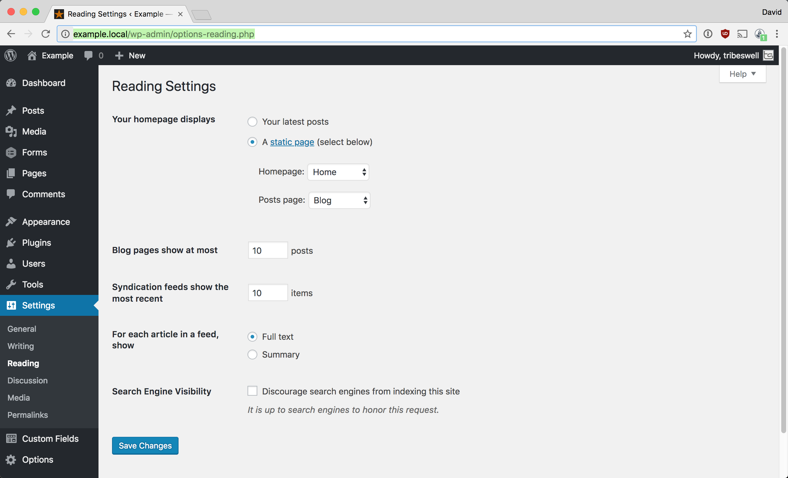
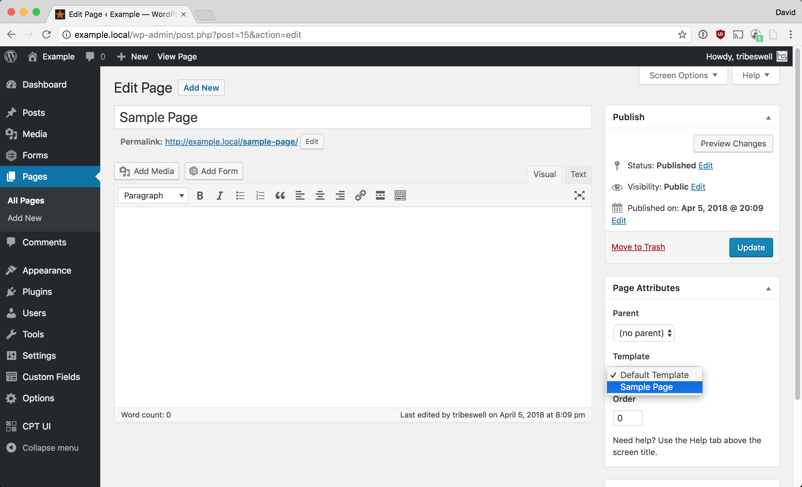

# WordPress Hierarchy

April 4, 2018

One of the first things you need to understand as you start working with WordPress is the [template heirarchy](https://developer.wordpress.org/themes/basics/template-hierarchy/) because you need to know which file to edit when you're working on a page. For a good visualization, check out [WP Hierarchy](https://wphierarchy.com/).

Before I get started with some explanations of the templates, let me declare some definitions so that everything below makes sense.

**Post Type** is basically like a model in the MVC convention. WordPress comes with two default post types in posts and pages. If you're creating an ecommerce store, then products and orders would be custom post types. Basically, if you need to create a set of things where each thing needs its own page, then use a custom post type.

**Taxonomy** is a way to classify post types. Again, WordPress comes with two default taxonomies in categories and tags. For the most part, this will be all you need, although you can create custom taxonomies. For instance, if you have a custom post type of employees, then you can create a custom taxonomy of departments to classify them. The main difference I've found between categories and tags is that categories can be hierarchical while tags cannot. Because of that fact, they also have two different UIs for adding them to posts.

With that out of the way, we can now get on to describe some of the common templates used in WordPress.

**archive.php** is used on pages where you're listing things. Usually custom post types, but also taxonomies. This is basically like the Blog page for posts, although it's not used for that (more on that later).

Let's say you have an employees custom post type and a departments custom taxonomy. By default, the pages that list employees, departments, categories, and tags will all use the `archive.php` file.

Let's say you want the page that lists employees to look different than the pages that list taxonomies (departments, categories, and tags). Then you can create an `archive-employee.php` file and the employees listing page will use this template while the taxonomy listing pages will use the `archive.php` template. Alternatively, you can create a `taxonomy.php` file and the taxonomies will use that while the employees listing page will use `archive.php`.

Let's say you want them to all have different templates. Then you'll use `archive.php` or `archive-employee.php` for listing employees, `category.php` for listing categories, `tag.php` for listing tags, and `taxonomy.php` or `taxonomy-department.php` for listing departments.

The next two main templates are `front-page.php` and `home.php`. When they're used all depends on one setting, **Your homepage displays** seen below.



If you set it to _Your latest posts_, then `home.php` will be used. Otherwise, if you set it to _A static page_, then the page you select for Homepage will use the `front-page.php` template while the page you select for Posts page will use `home.php`. Thus, regardless of what you select, the page that lists all posts will use `home.php`

**index.php** must be included in all themes as it's the catchall for all templates. That is, you can get rid of every other template and every page will use this template. You'll almost never end up using this template as you'll want your pages to look different from your posts and your archives to look different from your posts and pages.

**page.php** is the template for pages. If you need a certain page to look different than other pages, then you can create a `page-$template.php` template. In order to register your template with WordPress, the beginning of the file must have the template name like so

```php
<?php
/*
 * Template Name: Sample Page
 */
get_header(); the_post();
?>
```

Then you can set the template when you're editing the page.



**single.php** is the template for displaying a single post type, whether that be posts or a custom post type. Let's say you have an employees custom post type and you want your single employee page to look different than your posts. Then you can create `single-employee.php` template for your employee page and your posts will use `single.php`. Similarly, you can create a `single-post.php` file for your posts and employee pages will use the `single.php` template.

The following templates are pretty self-explanatory. If these are deleted, then the `index.php` template will be used.

**404.php** is the template for the 404 page.

**search.php** is the template for the search results page.
