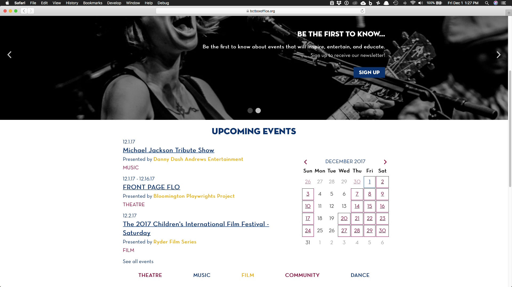
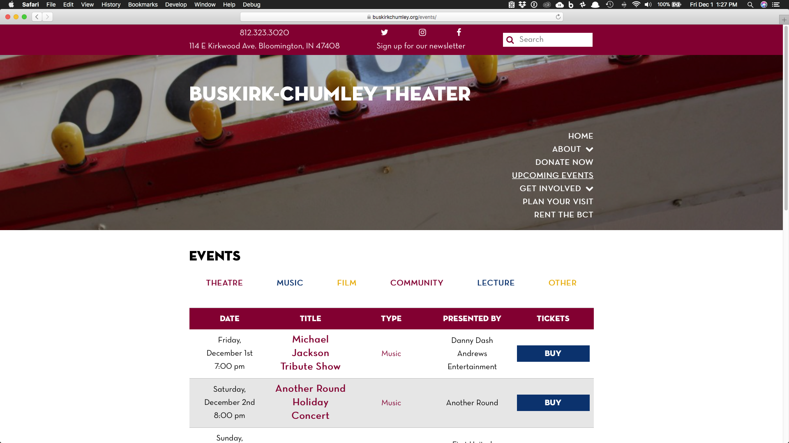
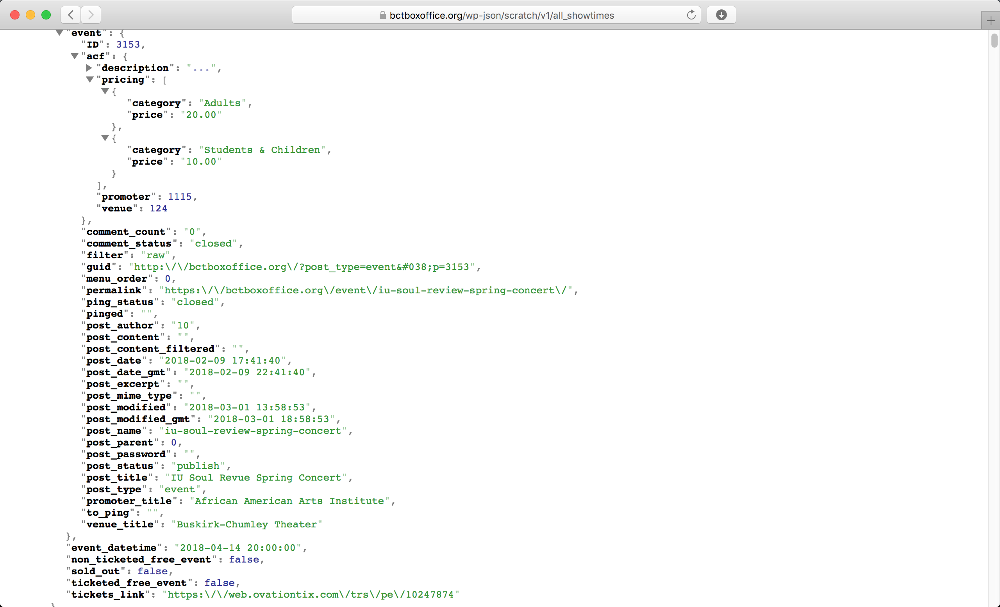

# Buskirk-Chumley Theatre & The BCT Box Office

Launched December 16, 2016

The Buskirk-Chumley Theatre is a historical landmark of Bloomington, Indiana so it was a great honor when they came to us to rebuild their sites. The main issue they had at the time was having to duplicate the same information on both sites as well as difficulty in entering information. I was able to cure their problem of cumbersome data-entry by utilizing ACF Pro. Creating custom endpoints through the WP REST API solved their dilemma of having to enter the same information twice for both websites.

The Box Office website handles the management of the events using custom post types for dates, events, venues, and promoters. Many events occur at multiple times across multiple dates with each occurence having a unique URL to but tickets. Staff will create events, venues, and promoters just once, and will link the event to a venue and promoter using ACF's [relationship](https://www.advancedcustomfields.com/resources/relationship/) field. Then for each occurrence of the event, the staff will create a date post where they'll select the associated event and link the unique URL for ticket buying. In addition, on a nightly basis, the website will add past events to an Archive category to remove it from the frontend, yet still have it available on the backend for the staff to remove at their leisure.

Because the total information for an event is spread across multiple post types, I created multiple custom endpoints using the WP REST API for the theatre website to easily consume event information. Using a cronjob, the theatre website pulls and updates its database on a nightly basis.

