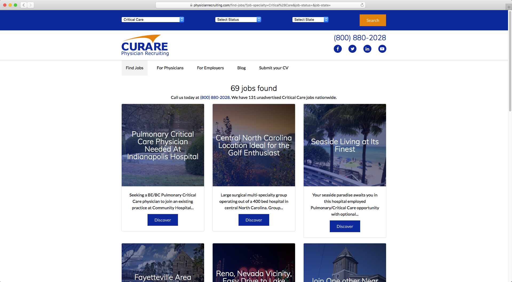

Curare Physician Recruiting is a job search engine specifically for physicians. New and current doctors can search for new positions by specialty and state. The original site was built with PHP and MSSQL along with Bootstrap for the design on the frontend. I was tasked with migrating the site to the WordPress framework along with updating the design on the frontend.

Physician Recruiting maintains a MSSQL database for management of their clients, jobs, and physicians. In addition to the Curare website redesign, I also update their Resource Management System (RMS) which is built on PHP and connected to the same MSSQL database as the Curare website. The Physician Recruiting staff utilizes the RMS to update the database so on a nightly basis the Curare website updates the WordPress with new information.

