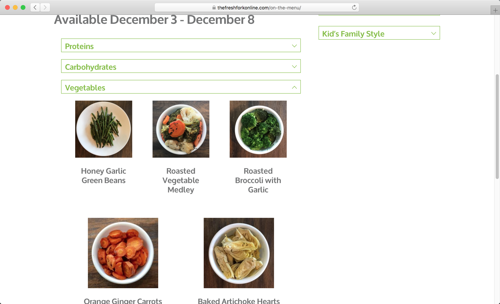
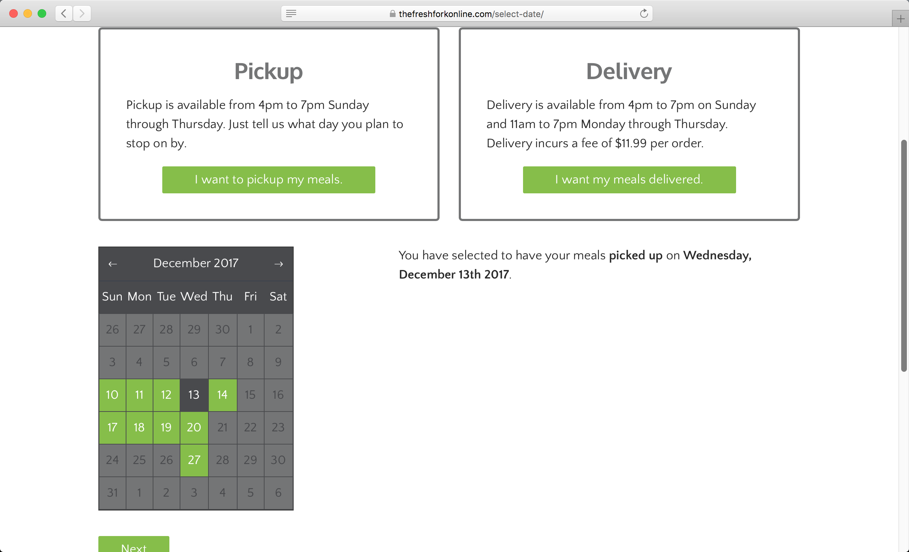

The Fresh Fork offers a unique take on the restaurant scene, providing prepared
meals in microwaveable to-go containers. Customers use the website to place
their order and then either pick up their food or have it delivered. With
multiple delivery services available in-town, this strategy drastically cuts
down on their payroll. It also, however, puts a great deal of responsibility on
the website to function correctly and timely.


## Technical Challenges

The main challenges the project invoked came from the ordering process. They
sort their menu items by proteins, carbs, and veggies, and each week they offer
a different assortment of menu items from each category. To create the menus, I
used an ACF repeater of relationship fields with WooCommerce products. Each menu
would then correspond to the available weeks of ordering.



Customers can order from 1-2 days up to 3-4 weeks in advance, but they cannot
order for the same day. Thus, ordering for this week will show a different menu
than ordering for next week. Each week at midnight between Thursday and Friday,
the current week's menu is discarded and next week's menu becomes the current
week's menu and so on and so forth. Thus the website must know which menu to
display when a customer chooses a pickup/delivery date.



A unique problem presented was that the restaurant is closed on Fridays and
Saturdays, but dates chosen must be at least one day in advance. Therefore, when
the customer orders on Thursday through Saturday, the menu from the next week
becomes the current menu. To determine which menu to use, I wrote a function
that finds the number of Saturdays between now and the customer's chosen date.

```php
function determineWeeklyMenu( $chosen_date )
{
  // Create a range of dates from now until the chosen date
  $startDate = new DateTime( 'today' );
  $endDate = new DateTime( $chosen_date );
  $interval = new DateInterval( 'P1D' );
  $dateRange = new DatePeriod( $startDate, $interval, $endDate );

  // Initialize the Saturday counter
  $day_of_today = intval( date( 'w', strtotime( 'today' ) ) );
  $saturday_counter = ( $day_of_today < 5 ) ? 0 : -1;

  // Iterate through the range of dates and
  // increase the counter when you come across a Saturday
  foreach ( $dateRange as $date ) {
    $day_of_week = intval( date( 'w', strtotime( $date->format( 'Y-m-d' ) ) ) );
    if ( $day_of_week === 6 ) $saturday_counter++;
  }

  // Return 0 for current week's menu, 1 for next week, and so on
  return $saturday_counter;
}
```

The second challenge arose from persisting the choices of pickup or delivery and
their chosen date. In a usual e-commerce format, the customer would choose these
options during the checkout process. In this case, these decisions had to be
made first since the menu depended on the customer's chosen date. I chose to use
cookies to save these choices and persist them through the ordering process.
Once the order is placed, the cookies are deleted if they had not been already
for another reason such as choosing another date or the day becoming
unavailable.
