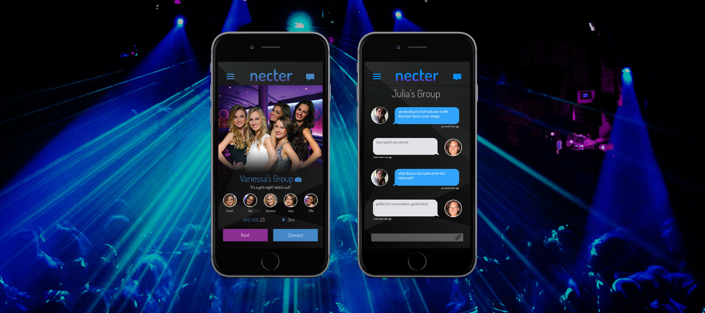

Necter is a hybrid app I built along with the accompanying website. As the sole
developer on this project, I was responsible for every commit from the first to
the last. Once the project neared completion, I oversaw semi-weekly testing
sessions with the client. The app was essentially Tinder Social, allowing
friends to create groups and swipe through other groups in the area to form
connections. Unfortunately, funding was lost for the project and it is no longer
maintained. This was my first project after joining Tribeswell.

## Technical Specifications

I used the Ionic Framework to build this hybrid app which utilized Angular v1.x.
I then integrated the app with Firebase v0.9 for the database. I also used
Facebook for login authorization so that groups can only be formed with mutual
friends. Pushwoosh was used a push notification source.

## App Description

Users were required to invite at least one and at most four friends to create a
group. They can also join a group, however they can only be a part of one group
at a time. Groups are then assigned a gender (male, female, or mixed) based on
their Facebook accounts and are allowed to set a gender preference for other
groups along with the search radius, where the center is the group creator's
last known coordinates.

Once at least one invited friend joins the group, the group members can begin to
swipe through other groups in hopes of forming connections. A connection between
two groups is formed when a majority of the members for both groups have "swiped
right" on each other. At that point, a private chat room is formed between all
of the members of both groups. Each group also has their own private chat room.

