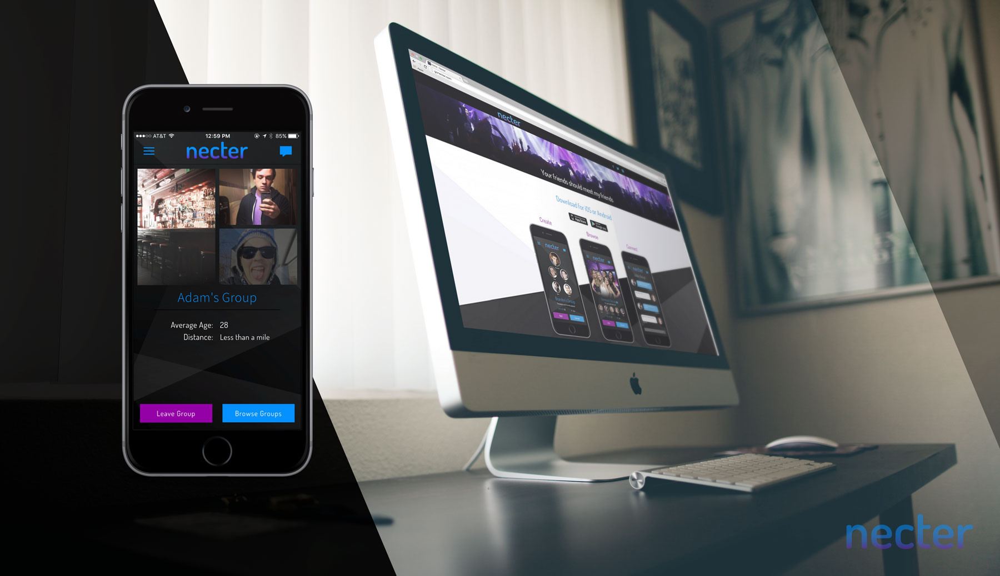

I was the sole developer on the Necter project, building a mobile app and accompanying website. The app was essentially Tinder Social, allowing friends to create groups and swiping through other groups in the area to form connections. Unfortunately, funding was lost for the project and it is no longer maintained. This was my first project after joining Tribeswell.

## Technical Specifications

I used the Ionic Framework to build this cross-platform mobile app which came bundled with Angular v1.x. I then integrated the app with Firebase v0.9 for the database. I also used Facebook for login authorization so that groups can only be formed with mutual Facebook friends. Pushwoosh was used a push notification source.
